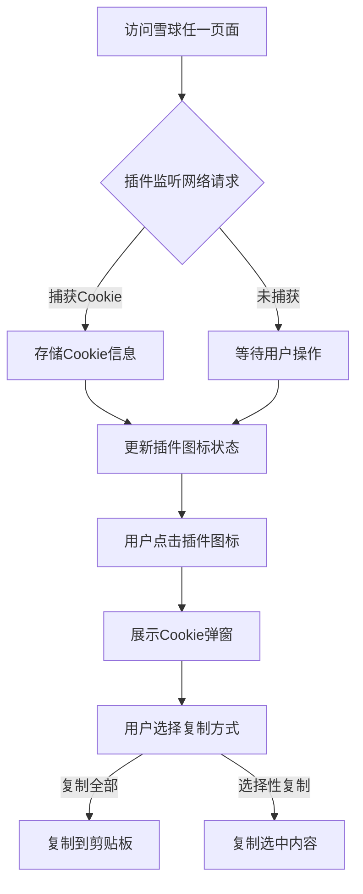

## 1. 产品概述

这是一个Chrome浏览器扩展插件，用于在用户访问雪球网域名下的页面时自动抓取请求Cookie，并提供便捷的查看和复制功能。插件仅在本地使用，不会将任何数据外传，确保用户隐私安全。

主要用途：帮助用户快速获取雪球网页面的Cookie信息，便于开发者或高级用户进行调试、分析或其他合法用途。

## 2. 核心功能

### 2.1 用户角色

| 角色   | 获取方式       | 核心权限               |
| ---- | ---------- | ------------------ |
| 普通用户 | Chrome商店安装 | 使用Cookie抓取、查看、复制功能 |

### 2.2 功能模块

插件包含以下核心功能：

1. **Cookie抓取**：当用户访问雪球网域名下任意页面时自动捕获请求Cookie
2. **弹窗展示**：通过浏览器弹窗清晰展示抓取到的Cookie信息
3. **一键复制**：提供便捷的复制功能，支持整体复制或选择性复制

### 2.3 功能详情

| 功能名称     | 模块名称 | 功能描述                                                                                    |
| -------- | ---- | --------------------------------------------------------------------------------------- |
| Cookie抓取 | 网络监听 | 监听用户访问雪球域名下所有页面（`https://xueqiu.com/*`，`https://*.xueqiu.com/*`）的网络请求，自动提取请求头中的Cookie信息 |
| 弹窗展示     | 用户界面 | 在浏览器右上角显示插件图标，点击后弹出简洁的弹窗界面，清晰展示抓取的Cookie内容                                              |
| 复制功能     | 交互操作 | 提供"复制全部"按钮，支持一键复制所有Cookie信息到剪贴板，同时支持选择性复制特定Cookie值                                      |

## 3. 核心流程

用户操作流程：

1. 用户安装插件后，访问雪球网任意页面
2. 插件自动监听网络请求，捕获Cookie信息
3. 插件图标显示抓取状态提示
4. 用户点击插件图标，查看Cookie详情
5. 用户选择复制全部或部分Cookie信息

## 4. 用户界面设计

### 4.1 设计风格

* **主色调**：Chrome扩展标准配色，以蓝色为主色调

* **按钮样式**：圆角矩形按钮，符合Chrome扩展UI规范

* **字体**：使用系统默认字体，确保清晰度

* **布局风格**：简洁的卡片式布局，信息层次清晰

* **图标风格**：使用标准的Cookie图标，直观易懂

### 4.2 界面元素

| 界面类型     | 模块名称 | UI元素                                  |
| -------- | ---- | ------------------------------------- |
| 插件图标     | 状态指示 | 显示Cookie抓取状态，正常状态为灰色图标，捕获到Cookie时变为蓝色 |
| 弹窗界面     | 信息展示 | 顶部显示页面标题，中间区域展示Cookie列表，底部提供复制按钮      |
| Cookie列表 | 内容展示 | 采用键值对形式展示，支持展开收起长内容，提供单独复制按钮          |

### 4.3 响应式设计

* 插件弹窗采用固定尺寸设计（350px × 400px）

* 内容区域支持滚动，适应不同长度的Cookie信息

* 按钮和交互元素针对鼠标操作优化

## 5. 隐私与安全

* 所有Cookie信息仅存储在本地内存中，不写入持久化存储

* 插件不会将任何数据发送到外部服务器

* 用户关闭弹窗或刷新页面后，Cookie信息自动清除

* 插件仅在用户访问雪球域名页面时激活（`xueqiu.com/*`、`*.xueqiu.com/*`），其他域名不运行

