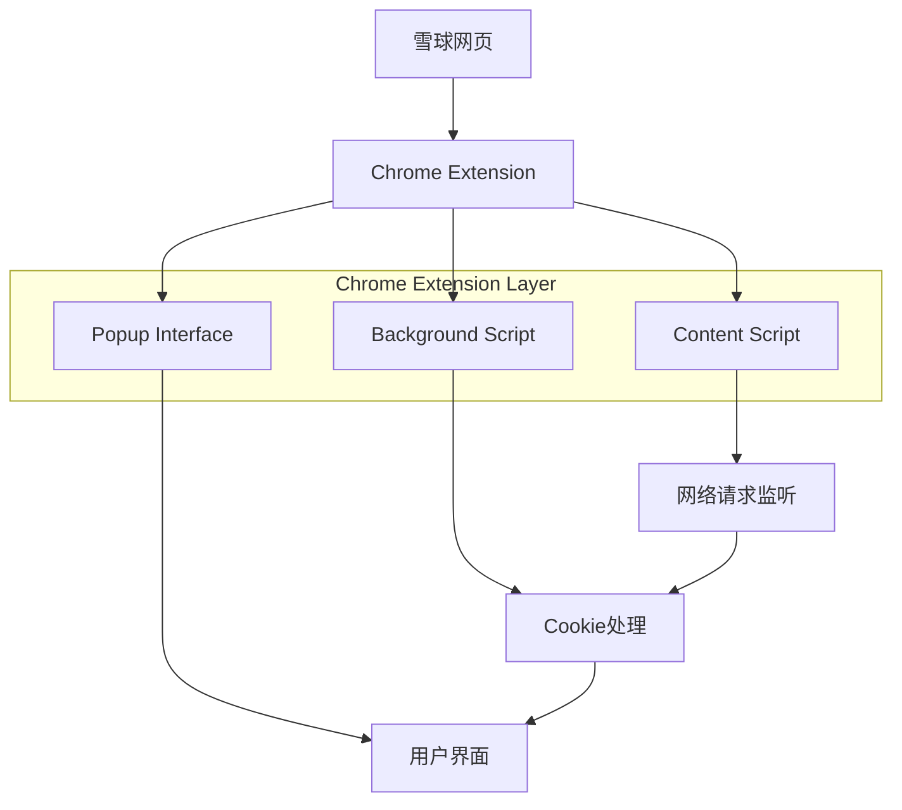
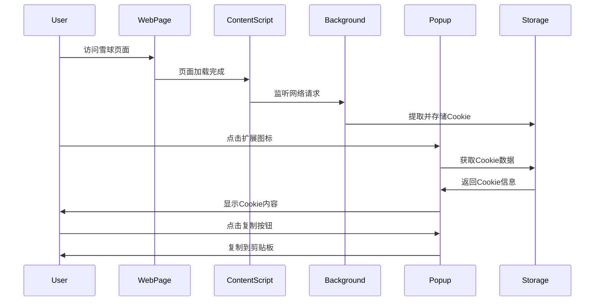

## 1. 架构设计



## 2. 技术栈描述

- **前端**: Chrome Extension Manifest V3 + HTML5 + CSS3 + JavaScript ES6+
- **初始化工具**: 无（Chrome扩展原生开发）
- **后端**: 无（纯客户端扩展）
- **存储**: Chrome Extension本地存储（chrome.storage.local）

## 3. 文件结构定义

| 文件类型 | 文件路径 | 用途 |
|----------|----------|------|
| manifest.json | /manifest.json | Chrome扩展配置文件 |
| content script | /content.js | 注入雪球页面的脚本 |
| background | /background.js | 后台服务脚本 |
| popup | /popup.html | 弹窗界面 |
| popup script | /popup.js | 弹窗交互逻辑 |
| popup style | /popup.css | 弹窗样式文件 |
| icons | /icons/ | 扩展图标文件 |

## 4. 核心API定义

### 4.1 Chrome Extension API使用

网络请求监听
```javascript
// 使用chrome.webRequest API监听网络请求
chrome.webRequest.onBeforeSendHeaders.addListener(
  function(details) {
    // 提取Cookie信息
    const cookies = extractCookies(details.requestHeaders);
    // 存储到本地
    chrome.storage.local.set({cookies: cookies});
  },
  {urls: ["*://xueqiu.com/*", "*://*.xueqiu.com/*"]},
  ["requestHeaders"]
);
```

Cookie信息处理
```javascript
// Cookie提取函数
function extractCookies(headers) {
  const cookieHeader = headers.find(header => 
    header.name.toLowerCase() === 'cookie'
  );
  return cookieHeader ? parseCookies(cookieHeader.value) : {};
}

// Cookie解析函数
function parseCookies(cookieString) {
  const cookies = {};
  cookieString.split(';').forEach(cookie => {
    const [name, value] = cookie.trim().split('=');
    cookies[name] = decodeURIComponent(value);
  });
  return cookies;
}
```

### 4.2 数据类型定义

```javascript
// Cookie数据结构
interface CookieData {
  [key: string]: string;
}

// 存储数据结构
interface StorageData {
  cookies: CookieData;
  timestamp: number;
  url: string;
}
```

## 5. 权限配置

在manifest.json中需要声明以下权限：

```json
{
  "permissions": [
    "webRequest",
    "storage",
    "activeTab",
    "*://xueqiu.com/*",
    "*://*.xueqiu.com/*"
  ],
  "host_permissions": [
    "*://xueqiu.com/*",
    "*://*.xueqiu.com/*"
  ]
}
```

## 6. 数据流设计



## 7. 安全与隐私设计

### 7.1 数据安全
- Cookie数据仅在内存中临时存储
- 使用chrome.storage.local进行临时存储，不写入磁盘
- 用户关闭弹窗后自动清除数据

### 7.2 权限最小化
- 仅申请必要的权限
- 限制在xueqiu.com域名范围内
- 不访问用户其他浏览数据

### 7.3 代码安全
- 使用Content Security Policy限制脚本执行
- 对用户输入进行验证和清理
- 避免使用eval等危险函数

## 8. 错误处理

### 8.1 网络错误处理
```javascript
try {
  const cookies = await extractCookiesFromRequest(details);
  await chrome.storage.local.set({cookies});
} catch (error) {
  console.error('Cookie提取失败:', error);
  // 显示用户友好的错误提示
}
```

### 8.2 存储错误处理
```javascript
chrome.storage.local.set({cookies}, () => {
  if (chrome.runtime.lastError) {
    console.error('存储失败:', chrome.runtime.lastError);
    // 回退到内存存储
  }
});
```
